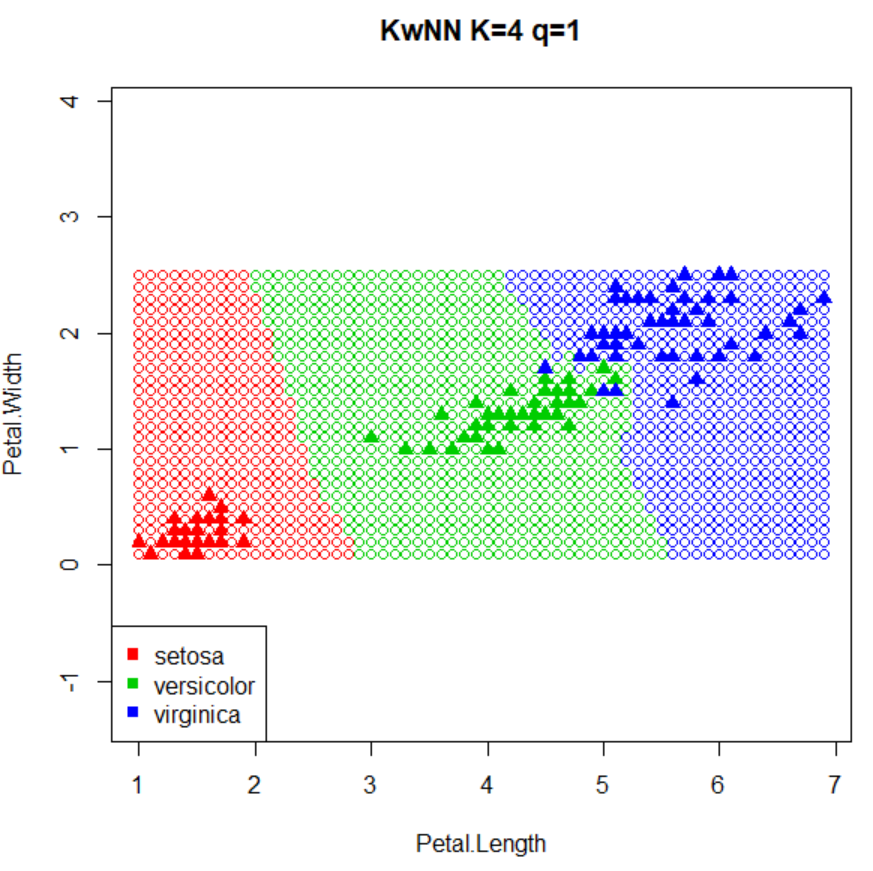

# Systems-and-methods-of-decision-making
# Тема: «Метрические	алгоритмы	классификации»

Метрические алгоритмы основываются на гипотезе компактоности, в которой сказано, что схожим объектам соответствуют схожие ответы. 

Для формализации понятия «сходства» вводится функция расстояния в пространстве объектов X.

ρ: X×X→ℝ ; ρ (X, X') - это мера близости, которая показывает насколько X похож на X'.

Метрические методы - это методы, которые основаны на анализе сходства объекстов.

Метрический алгоритм классификации  относит объект u к тому классу y , для которого суммарный вес ближайших обучающих объектов максимален.

К метрическим методам классификации относятся:
- KNN - алгоритм k ближайших соседей
- KwNN - алгоритм k взвешенных ближайших соседей
- PW - метод парзеновского окна
- PF - метод	потенциальных	функций
- STOLP - алгоритм отбора	эталонных	объектов

## Алгоритм	ближайших	соседей
### Алгоритм 	k ближайших	соседей	- KNN
Алгоритм анализа k ближайших соседей kNN - простейший метрический классификатор. Он относит классифицируемый объект к тому классу, элементов которого больше среди k ближайших соседей. 

Реализация алгоритма доступна по
[ссылке](kNN%20home.R)

При k = 1 этот алгоритм неустойчив к шуму. При k = ℓ, наоборот, он чрезмерно устойчив и вырождается в константу. Таким образом, крайние значения k нежелательны. На практике оптимальное значение параметра k определяют по критерию скользящего контроля с исключением объектов по одному (leave-one-out, LOO).

Суть LOO в слудующем:

1) Необходимо исключать объекты x(i) из выборки Xl по одному. Каждый раз получаем новую выборку без объекта x(i). Назовём её Xl_new.

2) Теперь будем запускать алгоритм от объекта u, который нужно классифицировать, на этой выборке Xl_new.

3) Заводим переменную Q (число ошибки, изначально Q = 0) и, когда алгоритм ошибается, увеличиваем число ошибок Q = Q + 1.

4) Когда все объекты x(i) будут перебраны, вычислить LOO = Q / l (где l - количество объектов выборки).

Для алгоритма KNN оптимальным оказалось K=6.

Недостатком LOO является большая ресурсоёмкость, так как обучаться приходится L раз. 

Стоит заметить, что если классифицируемый объект xi не исключать из обучающей выборки, то ближайшим соседом xi всегда будет сам xi, и минимальное (нулевое) значение функционала LOO(k) будет достигаться при k = 1.

Реализация алгоритма доступна по
[ссылке](loo%20knn.R)

### Алгоритм 	k взвешенных ближайших	соседей	- KwNN
 В задачах с числом классов 3 и более  могут возникать ситуации неоднозначности. Тогда i-му соседу приписывается вес w_i, как правило, убывающий с ростом ранга соседа i. Объект относится к тому классу, который набирает больший суммарный вес среди k ближайших соседей.

Реализация алгоритма доступна по
[ссылке](kwNN.R)

#### Недостатки простейших метрических алгоритмов типа kNN.
- Приходится хранить обучающую выборку целиком. Это приводит к неэффективному расходу памяти и чрезмерному усложнению решающего правила.
- Поиск ближайшего соседа предполагает сравнение классифицируемого объекта со всеми объектами выборки за O(ℓ) операций. Для задач с большими выборками или высокой частотой запросов это может оказаться накладно. Проблема решается с помощью эффективных алгоритмов поиска ближайших соседей, требующих в среднем O(ln ℓ) операций.
- В простейших случаях метрические алгоритмы имеют крайне бедный набор параметров, что исключает возможность настройки алгоритма по данным.

## Метод парзеновского окна
Для оценки близости объекта u к классу y алгоритм использует следующую функцию:

  , где K(z) — функция ядра (не возрастающая от 0 до бесконечности), а h — ширина окна (окно — сферическая окрестность классифицируемого объекта u радиуса h).

Выбор ядра слабо влияет на качество классификации. 

Преимущества алгоритма: 
- хорошее качество классификации при правильно подобраном h
- все точки с одинаковым расстоянием будут учитаны

Недостатки:
- необходимо хранить всю выборку целиком
- диапазон параметра h необходимо подбирать самостоятельно, учитывая плотность расположения точек
- если ни одна точка не попала в радиус h, алгоритм не способен ее классифицировать (не актуально для гауссовского ядра)

Реализация алгоритма доступна по
[ссылке](pw.R)

## Метод	потенциальных	функций

Если в методе парзеновского окна центр окна поместить в классифицируемый
объект, то получим метод потенциальных функций.

##  Отбор	эталонных	объектов

# Тема:	«Байесовские	алгоритмы	классификации»

## Линии	уровня	нормального	распределения

## Наивный	нормальный	байесовский	классификатор
Наивный байесовский классификатор (naїve Bayes) — специальный частный случай байесовского классификатора, основанный на дополнительном предположении, что объекты x  описываются n статистически независимыми признаками:

Предположение о независимости означает, что функции правдоподобия классов представимы в виде

где   — плотность распределения значений  j-го признака для класса y.

Предположение о независимости существенно упрощает задачу, так как оценить n одномерных плотностей гораздо легче, чем одну n-мерную плотность. К сожалению, оно крайне редко выполняется на практике, отсюда и название метода.

Наивный байесовский классификатор может быть как параметрическим, так и непараметрическим, в зависимости от того, каким методом восстанавливаются одномерные плотности.

Основные __преимущества__ наивного байесовского классификатора:
- Простота реализации.
- Низкие вычислительные затраты при обучении и классификации.
- В тех редких случаях, когда признаки действительно независимы (или почти независимы), наивный байесовский классификатор (почти) оптимален.

Основной его __недостаток__ — относительно низкое качество классификации в большинстве реальных задач.

Чаще всего он используется либо как примитивный эталон для сравнения различных моделей алгоритмов, либо как элементарный строительный блок в алгоритмических композициях.

Реализация алгоритма доступна по
[ссылке](nbc.R)

## Подстановочный	алгоритм	(plug-in)

## Линейный	дискриминант	Фишера	– ЛДФ

## Сеть	радиальных	базисных	функций	– RBF сеть

# Тема	«Линейные	алгоритмы	классификации»
## ADALINE
Адаптивный линейный элемент(Адаптивный линейный нейрон или ADALINE) - частный случай линейного классификатора или искусственной нейронной сети с одним слоем. Был предложен Видроу и Хоффом в 1960 году, развивая математическую модель нейрона МакКаллока–Питтса.

Общая схема работы ADALINE
Схема работы ADALINE несколько напоминает работу биологического нейрона: 
На вход подаётся вектор импульсов xn ,состоящий из n числовых признаков. Внутри нейрона импульсы складываются с некоторыми весами wj, j = 1..n и, если суммарный импульс S(x) = sum_{j=1}^n w_j*x_j превысит порог активации w0, то нейрон возбуждается и выдаёт некоторое значение a(x) = S(x) - w0. 

Если добавить фиктивный импульс-признак x0 ≡ -1 и ему сопоставить вес w0 - порог активации, то формулу выхода Y(x) можно выписать более компактно: 
a(x) =(w,x) , где (w,x) - скалярное произведение, w и x - векторы весов и импульсов-признаков соответственно.

Реализация алгоритма доступна по
[ссылке](ad.R)

## Логистическая	регрессия

## Метод	опорных	векторов	– SVM.	ROC-кривая
